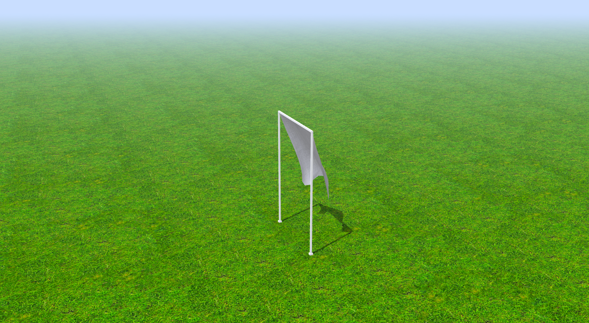

# Cloth Simulation using Three.js



## Overview
Cloth Simulation is an open-source project built with [Three.js](https://threejs.org/) to simulate cloth behavior in a 3D environment. It demonstrates realistic cloth physics, leveraging WebGL and JavaScript for an interactive visual experience.

## Features
- Real-time cloth simulation with physics.
- User-friendly rendering using Three.js.
- Fully responsive visualization.

## Libraries and Dependencies
The project relies on the following libraries and modules:
- **Three.js**: A lightweight JavaScript library for creating and rendering 3D graphics.
- **OrbitControls**: Enables mouse interaction with the 3D scene.

## Installation
Follow these steps to run the project locally:

1. Clone the repository:
   ```bash
   git clone https://github.com/cybertiwari/Cloth-Simulation.git
   ```

2. Navigate to the project directory:
   ```bash
   cd Cloth-Simulation
   ```

3. Open the `index.html` file using any local server (e.g., Python's HTTP server):
   ```bash
   python -m http.server
   ```
   Alternatively, use any tool like [VS Code Live Server](https://marketplace.visualstudio.com/items?itemName=ritwickdey.LiveServer).

4. Open the project in your browser at `http://localhost:8000` (or the port specified by your server).

## Usage
- Open the project in your browser.
- Interact with the cloth simulation by rotating, zooming, or panning the camera.

## Contributing
Contributions are welcome! Feel free to submit issues or pull requests to improve the project.

## License
This project is licensed under the [MIT License](https://github.com/cybertiwari/Cloth-Simulation/blob/main/LICENSE).

## Repository Link
[Cloth Simulation GitHub Repository](https://github.com/cybertiwari/Cloth-Simulation)